# Домашнее задание к занятию "6.2. SQL"

## Задача 1
    Используя docker поднимите инстанс PostgreSQL (версию 12) c 2 volume, в который будут складываться данные БД и бэкапы.
    Приведите получившуюся команду или docker-compose манифест.
-----------------------------------------------------------------------------
* Docker-compose.yml:
```yaml
version: '3.3'

services:
  postgres:
    container_name: postgres_container
    image: postgres
    environment:
      POSTGRES_USER: ${POSTGRES_USER:-postgres}
      POSTGRES_PASSWORD: ${POSTGRES_PASSWORD:-changeme}
      PGDATA: /var/lib/data/postgres
    volumes:
       - postgres:/var/lib/postgresql/data
       - postgres_backup:/var/lib/postgresql_backup/data
    ports:
      - "5432:5432"
    networks:
      - postgres
    restart: unless-stopped
  
networks:
  postgres:
    driver: bridge

volumes:
    postgres:
    postgres_backup:
```
* Забираем образ с postgres:
```shell
 docker pull postgres:12
12: Pulling from library/postgres
a330b6cecb98: Pull complete 
3b0b899b4747: Pull complete 
cc0b2671a552: Pull complete 
1a7c7505993a: Pull complete 
02cdead79556: Pull complete 
0d8fbe9259d6: Pull complete 
974e6d476aa7: Pull complete 
e9abf0d5d0bc: Pull complete 
7e183c298f90: Pull complete 
4629bd6083ca: Pull complete 
ea9afb153dc4: Pull complete 
5db27f65d696: Pull complete 
5c9bcf85b9a6: Pull complete 
Digest: sha256:5afbf72bfdb224f9ad3b29dd570747b4752ab2e81e9c25145847004f8a350e60
Status: Downloaded newer image for postgres:12
docker.io/library/postgres:12
```
* Запускаем контейнеры с `docker-compose`:
```shell
 sudo docker-compose up -d
Pulling postgres (postgres:)...
latest: Pulling from library/postgres
a330b6cecb98: Already exists
3b0b899b4747: Already exists
cc0b2671a552: Already exists
1a7c7505993a: Already exists
02cdead79556: Already exists
0d8fbe9259d6: Already exists
974e6d476aa7: Already exists
e9abf0d5d0bc: Already exists
38a9de11c706: Pull complete
a3864ed531fa: Pull complete
de957ee6c50c: Pull complete
a8eba1185eab: Pull complete
67aed56271be: Pull complete
Digest: sha256:97e5e91582e89514277912d4b7c95bceabdede3482e32395bcb40099abd9c506
Status: Downloaded newer image for postgres:latest
Creating volume "postgresql_postgres" with default driver
Creating volume "postgresql_postgres_backup" with default driver
Creating postgres_container ... done
```
* Наши тома:
```shell
lerekler@lerekler-Pavilion:~/Learning/WorkFolder/docker-projects/postgresql$ docker volume ls
DRIVER    VOLUME NAME
local     postgresql_postgres
local     postgresql_postgres_backup
```
* Заходим в БД:
```shell
$ psql -h localhost -p 5432 -U postgres
Password for user postgres: 
psql (12.8 (Ubuntu 12.8-0ubuntu0.20.04.1), server 13.4 (Debian 13.4-1.pgdg100+1))
WARNING: psql major version 12, server major version 13.
         Some psql features might not work.
Type "help" for help.

postgres=# 
```
---------------------------------------------------------------------------------
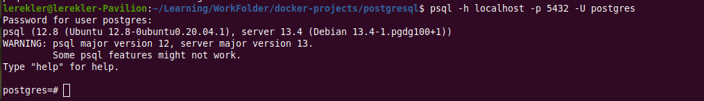

---------------------------------------------------------------------------------

## Задача 2
    В БД из задачи 1:    
    -   создайте пользователя test-admin-user и БД test_db
    -   в БД test_db создайте таблицу orders и clients (спeцификация таблиц ниже)
    -   предоставьте привилегии на все операции пользователю test-admin-user на таблицы БД test_db
    -   создайте пользователя test-simple-user
    -   предоставьте пользователю test-simple-user права на SELECT/INSERT/UPDATE/DELETE данных таблиц БД test_db

```shell
postgres=# CREATE DATABASE test_db;
postgres=# \c test_db
psql (12.8 (Ubuntu 12.8-0ubuntu0.20.04.1), server 13.4 (Debian 13.4-1.pgdg100+1))
WARNING: psql major version 12, server major version 13.
         Some psql features might not work.
You are now connected to database "test_db" as user "postgres".
```

    CREATE USER test_admin_user WITH SUPERUSER NOCREATEDB NOCREATEROLE NOINHERIT LOGIN;
    CREATE TABLE orders (
            id integer PRIMARY KEY, 
            name text, price int
    );
    CREATE TABLE clients (
            id integer PRIMARY KEY, 
            lastname text, 
            country text, 
            id_order integer, 
            FOREIGN KEY(id_order) REFERENCES orders (id)
    );
    GRANT ALL ON DATABASE test_db TO test_admin_user;
    CREATE USER test_simple_user WITH NOSUPERUSER NOCREATEDB NOCREATEROLE NOINHERIT LOGIN;
    GRANT SELECT ON clients TO test_simple_user;
    GRANT INSERT ON clients TO test_simple_user;
    GRANT UPDATE ON clients TO test_simple_user;
    GRANT DELETE ON clients TO test_simple_user;
    GRANT SELECT ON orders TO test_simple_user;
    GRANT INSERT ON orders TO test_simple_user;
    GRANT UPDATE ON orders TO test_simple_user;
    GRANT DELETE ON orders TO test_simple_user;

---------------------------------------------------------------------------------
* Список БД:

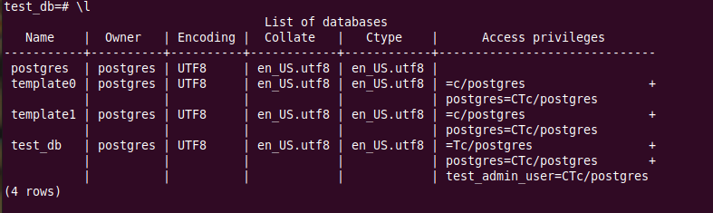

---------------------------------------------------------------------------------
---------------------------------------------------------------------------------
* Describe table `orders`:

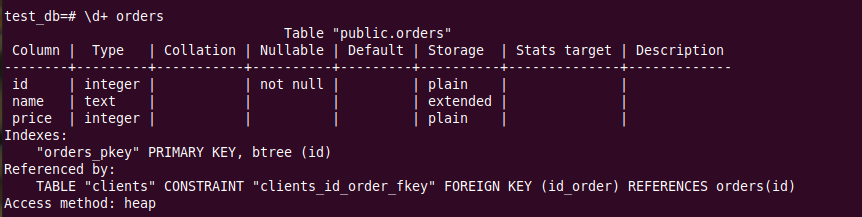

---------------------------------------------------------------------------------
---------------------------------------------------------------------------------
* Describe table `clients`:

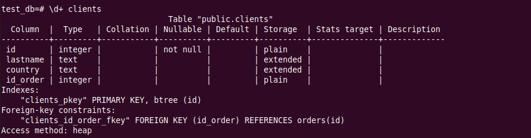

---------------------------------------------------------------------------------
* SQL-запрос для выдачи списка пользователей с правами над таблицами test_db
  * Сам запрос:

      _**SELECT**_ * 
      _**FROM**_ information_schema.role_table_grants 
      _**WHERE**_ table_catalog = 'test_db' 
          _**AND**_ table_name _**IN**_ ('clients', 'orders');

---------------------------------------------------------------------------------
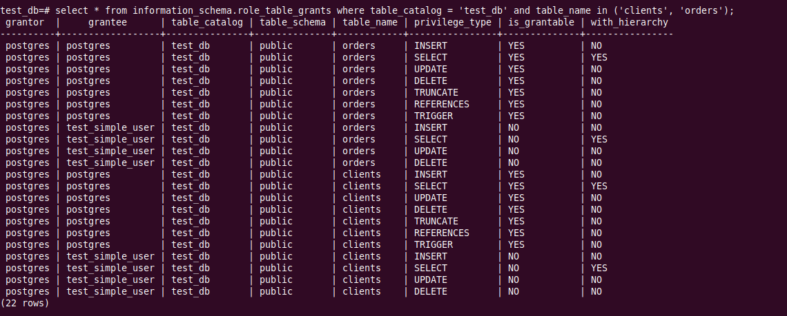

---------------------------------------------------------------------------------
* Список пользователей с правами над таблицами test_db

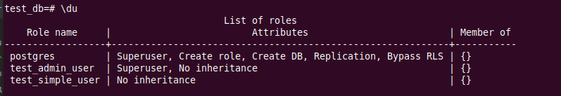

---------------------------------------------------------------------------------

## Задача 3
    Используя SQL синтаксис - наполните таблицы тестовыми данными
-----------------------------------------
Здесь я перешла на DBeaver, т.к. с ним удобнее работать, оперируя данными. Есть необходимая подстветка синтаксиса

---------------------------------------------------------------------------------
* Заполнили:

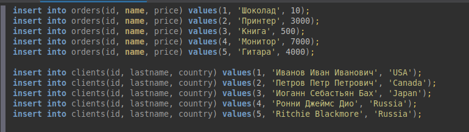

---------------------------------------------------------------------------------
---------------------------------------------------------------------------------
* Количество записей по таблицам:

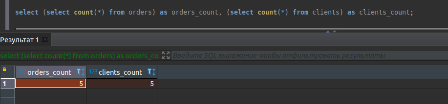

---------------------------------------------------------------------------------

<details>
<summary>Запросы sql</summary>

    insert into orders(id, name, price) values(1, 'Шоколад', 10);
    insert into orders(id, name, price) values(2, 'Принтер', 3000);
    insert into orders(id, name, price) values(3, 'Книга', 500);
    insert into orders(id, name, price) values(4, 'Монитор', 7000);
    insert into orders(id, name, price) values(5, 'Гитара', 4000);
    
    insert into clients(id, lastname, country) values(1, 'Иванов Иван Иванович', 'USA');
    insert into clients(id, lastname, country) values(2, 'Петров Петр Петрович', 'Canada');
    insert into clients(id, lastname, country) values(3, 'Иоганн Себастьян Бах', 'Japan');
    insert into clients(id, lastname, country) values(4, 'Ронни Джеймс Дио', 'Russia');
    insert into clients(id, lastname, country) values(5, 'Ritchie Blackmore', 'Russia');    
    
    select count(*) from orders o ;    
    select count(*) from clients;    
    select (select count(*) from orders) as orders_count, (select count(*) from clients) as clients_count;
</details>

## Задача 4

    Часть пользователей из таблицы clients решили оформить заказы из таблицы orders.    
    Используя foreign keys свяжите записи из таблиц, согласно таблице    
    * Иванов Иван Иванович -	Книга
    * Петров Петр Петрович -	Монитор
    * Иоганн Себастьян Бах -	Гитара

---------------------------------------------------------------------------------
* Добавим записи:


---------------------------------------------------------------------------------
---------------------------------------------------------------------------------
* Посмотрим тех клиентов, кто сделал заказ:

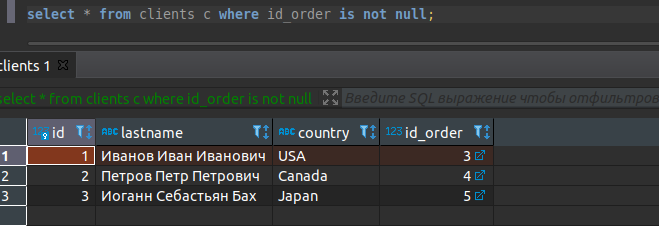

---------------------------------------------------------------------------------
---------------------------------------------------------------------------------
* Посмотрим, какие заказы они сделали:

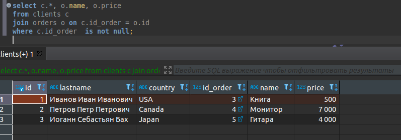

---------------------------------------------------------------------------------
---------------------------------------------------------------------------------

<details>
<summary>Запросы sql</summary>

    update clients set id_order = 3 where id = 1; -- Иванов Иван Иванович -	Книга
    update clients set id_order = 4 where id = 2; -- Петров Петр Петрович -	Монитор
    update clients set id_order = 5 where id = 3; -- Иоганн Себастьян Бах -	Гитара
    commit;
    
    select * from clients c where id_order is not null;
    
    select c.*, o.name, o.price
    from clients c 
    join orders o on c.id_order = o.id 
    where c.id_order  is not null;

</details>

## Задача 5
    Получите полную информацию по выполнению запроса выдачи всех пользователей из задачи 4 (используя директиву EXPLAIN).
    Приведите получившийся результат и объясните что значат полученные значения.

---------------------------------------------------------------------------------
---------------------------------------------------------------------------------
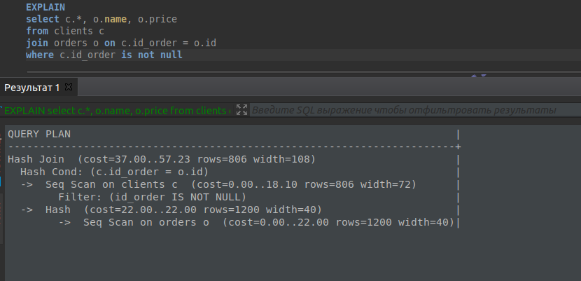

---------------------------------------------------------------------------------
---------------------------------------------------------------------------------
* Планировщик выбрал соединение по хешу, при котором строки таблицы `clients` записываются в хэш-таблицу в памяти, после чего сканируется таблица `orders` и для каждой её строки проверяется соответствие по хеш-таблице.
* Узел `Hash` конструирует хеш-таблицу, передает план `Hash Join`, который читает строки из узла внешнего потомка и проверяет их по этой хеш-таблице.

## Задача 6
    Создайте бэкап БД test_db и поместите его в volume, предназначенный для бэкапов (см. Задачу 1).
    Остановите контейнер с PostgreSQL (но не удаляйте volumes).
    Поднимите новый пустой контейнер с PostgreSQL.
    Восстановите БД test_db в новом контейнере.
    Приведите список операций, который вы применяли для бэкапа данных и восстановления.

* Очень долго искала информацию, как:
  * Копировать в том данные из контейнера;
  * Как восстановить их в другом томе.
* Но то ли не там искала, то ли неправильно смонтировала их, к успеху не пришла.
* Следующая команда приводила к тому, что backup был пустым:
```shell
docker run --volume /var/lib/data/postgres:/var/lib/postgresql/data --volume $(pwd):/backup ubuntu tar cvf backupvol.tar --absolute-names /var/lib/postgresql/data
```
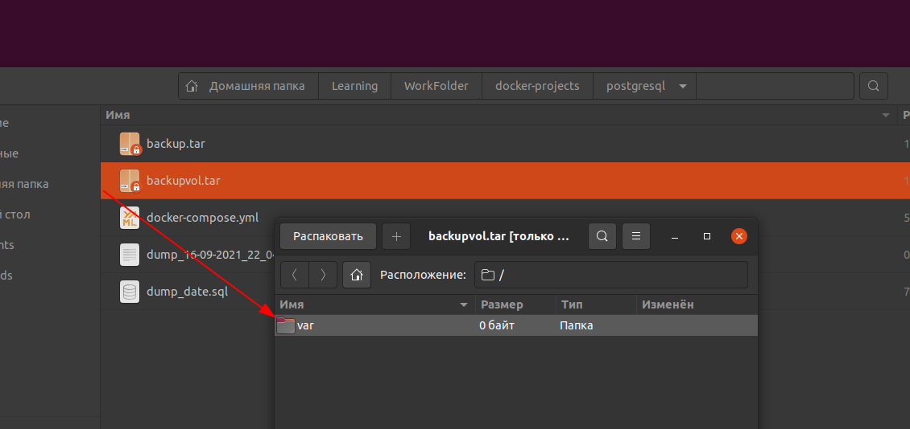

* Долго билась с этим, но поняла, что не хватает теории в части составления файла `docker-compose` и работы с `volumes`.
* Поэтому я забэкапила саму базу таким образом:
```shell
$ docker exec -t postgres_container pg_dump -c -U postgres -d test_db > dump.sql
```
* Остановила контейнер:
```shell
$ docker stop postgres_container 
```
* Подняла новый: 
```shell
$ docker run --rm --name postgres_backup -e POSTGRES_USER=postgres -e POSTGRES_PASSWORD=changeme -d -p 5432:5432 -v postgres_backup:/var/lib/postgresql_backup/data postgres:12
e101385a09ff04776255acc1a2b547781bbdeba7ca4637837aa85abd3a0f9ecd

$ docker ps
CONTAINER ID   IMAGE         COMMAND                  CREATED         STATUS         PORTS                                       NAMES
e101385a09ff   postgres:12   "docker-entrypoint.s…"   3 minutes ago   Up 3 minutes   0.0.0.0:5432->5432/tcp, :::5432->5432/tcp   postgres_backup
```
* Восстановила из dump'a:
```shell
$ cat dump_test.sql | docker exec -i postgres_backup psql -U postgres
SET
SET
SET
SET
SET
 set_config 
------------
 
(1 row)

SET
SET
SET
SET
SET
SET
ALTER ROLE
CREATE ROLE
ALTER ROLE
CREATE ROLE
ALTER ROLE
CREATE TABLE
ALTER TABLE
CREATE TABLE
ALTER TABLE
COPY 5
COPY 5
ALTER TABLE
ALTER TABLE
ALTER TABLE
GRANT
GRANT
```
* Проверим работоспобность, зайдем в базу:
```shell
$ psql -h localhost -p 5432 -U postgres
Password for user postgres: 
psql (12.8 (Ubuntu 12.8-0ubuntu0.20.04.1))
Type "help" for help.
```
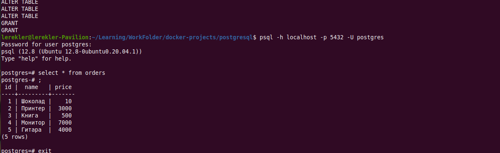

* DBeaver:

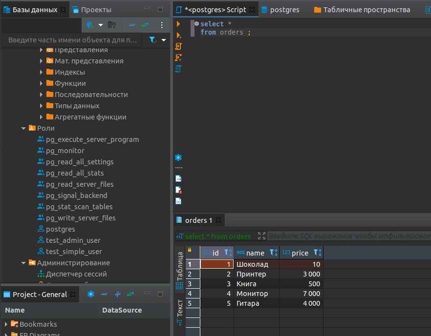