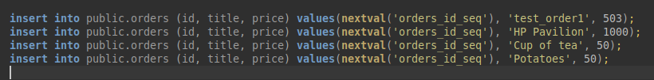
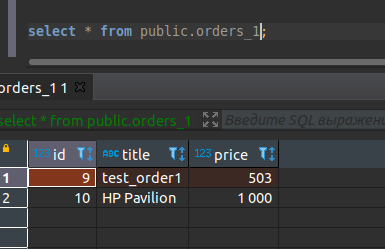
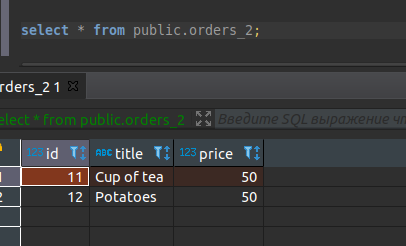
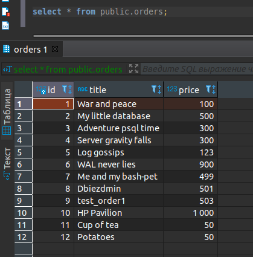

# Домашнее задание к занятию "6.4. PostgreSQL"

## Задача 1

        Используя docker поднимите инстанс PostgreSQL (версию 13). Данные БД сохраните в volume.        
        Подключитесь к БД PostgreSQL используя psql.        
        Воспользуйтесь командой \? для вывода подсказки по имеющимся в psql управляющим командам.        
        Найдите и приведите управляющие команды для:        
            -   вывода списка БД
            -   подключения к БД
            -   вывода списка таблиц
            -   вывода описания содержимого таблиц
            -   выхода из psql

* Поднимаем инстанс: 
```shell
$ docker pull postgres:13
f8416d8bac72: Pull complete 
...
Digest: sha256:90c1ddddb38152f7260014bc4d3d10209cebbd5e25346cea07b00efd8e36028e
Status: Downloaded newer image for postgres:13
docker.io/library/postgres:13
```
* Создаем том и запускаем контейнер:
```shell
$ docker volume create datapostgres
datapostgres

$ docker run --rm --name some-postgres -e POSTGRES_USER=postgres -e POSTGRES_PASSWORD=changeme -p 5432:5432 -dti -v datapostgres:/home/lerekler/Learning/WorkFolder/docker-projects/postgresql13/data postgres:13
a98e26cdfcb692d3c87133bbb37d73f11a9397438f5cf131018cbda894e5ee75
lerekler@lerekler-Pavilion:~/Learning/WorkFolder/docker-projects/postgresql13 $ docker ps
CONTAINER ID   IMAGE         COMMAND                  CREATED         STATUS         PORTS                                       NAMES
a98e26cdfcb6   postgres:13   "docker-entrypoint.s…"   3 seconds ago   Up 3 seconds   0.0.0.0:5432->5432/tcp, :::5432->5432/tcp   some-postgres
```

* Подключаемся к БД:
```shell
$ psql -h localhost -p 5432 -U postgres
Password for user postgres: 
psql (12.8 (Ubuntu 12.8-0ubuntu0.20.04.1), server 13.4 (Debian 13.4-1.pgdg110+1))
WARNING: psql major version 12, server major version 13.
         Some psql features might not work.
Type "help" for help.

postgres=# 
```

* Команды:

|   Описание            |   Команда     |
|:---------------------:|:--------------|
| Вывод списка БД       |  \l           |
| Подключение к БД      |  \c {DBNAME..}|
| Вывод списка таблиц   |  \dt[S+]      |
| Вывод описания содержимого таблиц |   \d[S+]|
| Выход из psql         |   \q          |

## Задача 2

    Используя psql создайте БД test_database.
    Изучите бэкап БД.
    Восстановите бэкап БД в test_database.
    Перейдите в управляющую консоль psql внутри контейнера.
    Подключитесь к восстановленной БД и проведите операцию ANALYZE для сбора статистики по таблице.
    Используя таблицу pg_stats, найдите столбец таблицы orders с наибольшим средним значением размера элементов в байтах.
    Приведите в ответе команду, которую вы использовали для вычисления и полученный результат.


```shell
postgres=# CREATE DATABASE test_database;
CREATE DATABASE
postgres=# \l
                                   List of databases
     Name      |  Owner   | Encoding |  Collate   |   Ctype    |   Access privileges   
---------------+----------+----------+------------+------------+-----------------------
 postgres      | postgres | UTF8     | en_US.utf8 | en_US.utf8 | 
 template0     | postgres | UTF8     | en_US.utf8 | en_US.utf8 | =c/postgres          +
               |          |          |            |            | postgres=CTc/postgres
 template1     | postgres | UTF8     | en_US.utf8 | en_US.utf8 | =c/postgres          +
               |          |          |            |            | postgres=CTc/postgres
 test_database | postgres | UTF8     | en_US.utf8 | en_US.utf8 | 
(4 rows)

postgres=# \c test_database
psql (12.8 (Ubuntu 12.8-0ubuntu0.20.04.1), server 13.4 (Debian 13.4-1.pgdg110+1))
WARNING: psql major version 12, server major version 13.
         Some psql features might not work.
You are now connected to database "test_database" as user "postgres".
test_database=# 


```

* Restore:
```shell
$ cat test_dump.sql | docker exec -i some-postgres psql -U postgres -d test_database
SET
SET
SET
SET
SET
 set_config 
------------
 
(1 row)

SET
SET
SET
SET
SET
SET
CREATE TABLE
ALTER TABLE
CREATE SEQUENCE
ALTER TABLE
ALTER SEQUENCE
ALTER TABLE
COPY 8
 setval 
--------
      8
(1 row)

ALTER TABLE

```
* Убедимся, что все на месте:
```shell
$ psql -h localhost -p 5432 -U postgres
Password for user postgres: 
psql (12.8 (Ubuntu 12.8-0ubuntu0.20.04.1), server 13.4 (Debian 13.4-1.pgdg110+1))
WARNING: psql major version 12, server major version 13.
         Some psql features might not work.
Type "help" for help.

postgres=# \c test_database
psql (12.8 (Ubuntu 12.8-0ubuntu0.20.04.1), server 13.4 (Debian 13.4-1.pgdg110+1))
WARNING: psql major version 12, server major version 13.
         Some psql features might not work.
You are now connected to database "test_database" as user "postgres".
test_database=# \dt+
                       List of relations
 Schema |  Name  | Type  |  Owner   |    Size    | Description 
--------+--------+-------+----------+------------+-------------
 public | orders | table | postgres | 8192 bytes | 
(1 row)
test_database=# select * from public.orders;
 id |        title         | price 
----+----------------------+-------
  1 | War and peace        |   100
  2 | My little database   |   500
  3 | Adventure psql time  |   300
  4 | Server gravity falls |   300
  5 | Log gossips          |   123
  6 | WAL never lies       |   900
  7 | Me and my bash-pet   |   499
  8 | Dbiezdmin            |   501
(8 rows)

```

* ANALYZE:
```shell
test_database=# ANALYZE VERBOSE public.orders;
INFO:  analyzing "public.orders"
INFO:  "orders": scanned 1 of 1 pages, containing 8 live rows and 0 dead rows; 8 rows in sample, 8 estimated total rows
ANALYZE
```
* Столбец таблицы `orders` с наибольшим средним значением размера элементов в байтах - `title`.
```shell
test_database=# select attname, avg_width from pg_stats where schemaname = 'public' and tablename = 'orders' and avg_width in (select max(avg_width) from pg_stats where schemaname = 'public' and tablename = 'orders');
 attname | avg_width 
---------+-----------
 title   |        16
(1 row)
```
* И запрос, который возвращает максимальное среднее значение по всем столбцам таблицы:
```shell
test_database=# select attname, max(avg_width) from pg_stats where schemaname = 'public' and tablename = 'orders' group by attname;
 attname | max 
---------+-----
 id      |   4
 price   |   4
 title   |  16
(3 rows)
```

## Задача 3

    Архитектор и администратор БД выяснили, что ваша таблица orders разрослась до невиданных размеров и поиск по ней занимает 
    долгое время. Вам, как успешному выпускнику курсов DevOps в нетологии предложили провести разбиение таблицы на 2 (шардировать 
    на orders_1 - price>499 и orders_2 - price<=499).    
    Предложите SQL-транзакцию для проведения данной операции.    
    Можно ли было изначально исключить "ручное" разбиение при проектировании таблицы orders?

```shell
CREATE TABLE public.orders_1 (
    CHECK (price > 499)
) INHERITS (public.orders)
  
CREATE TABLE public.orders_2 (
    CHECK (price <= 499)
) INHERITS (public.orders)
#
# Добавим правила, чтобы новые записи с price > 499 или price <= 499 добавлялись не в public.orders, а в нужные партиции 
#
CREATE RULE new_insert_to_ord1 
AS ON INSERT TO public.orders
WHERE (price > 499)
DO INSTEAD INSERT INTO public.orders_1 
VALUES (NEW.*)  

CREATE RULE new_insert_to_ord2 
AS ON INSERT TO public.orders
WHERE (price <= 499)
DO INSTEAD INSERT INTO public.orders_2 
VALUES (NEW.*)  
```
* Далее добавила несколько строк в таблицу:



**Вывод результатов по таблицам**

------------------------------------------------------------------------------------
* Orders_1:



------------------------------------------------------------------------------------
* Orders_2:



------------------------------------------------------------------------------------
* Orders:



------------------------------------------------------------------------------------

* При создании таблицы можно сразу добавить секционирование с опцией `PARTITION BY`. Пример из документации `PostgreSQL`:
```shell
CREATE TABLE measurement (
    city_id         int not null,
    logdate         date not null,
    peaktemp        int,
    unitsales       int
) PARTITION BY RANGE (logdate); # добавили партицирование по методу RANGE. Данные будут ранжироваться по атрибуту logdate 
```
* И далее можно добавить секции. Остановимся на примере с документацией:
```shell
CREATE TABLE measurement_y2006m02 PARTITION OF measurement
    FOR VALUES FROM ('2006-02-01') TO ('2006-03-01');

CREATE TABLE measurement_y2006m03 PARTITION OF measurement
    FOR VALUES FROM ('2006-03-01') TO ('2006-04-01');

...
```
* И добавим индекс по секционированной таблице:
```shell
CREATE INDEX ON measurement (logdate);
```

## Задача 4

    Используя утилиту pg_dump создайте бекап БД test_database.
    Как бы вы доработали бэкап-файл, чтобы добавить уникальность значения столбца title для таблиц test_database?

* Бэкап данных:
```shell
$ docker exec -t some-postgres pg_dump -c -U postgres -d test_database > dump_new.sql
```
* Сам файл бэкапа: [dump_new.sql](6.4ex/dump_new.sql)

* Уникальность можно добавить при создании таблицы:
```shell
CREATE TABLE public.orders (
    id integer NOT NULL,
    title character varying(80) NOT NULL,
    price integer DEFAULT 0
    CONSTRAINT orders_title_unique UNIQUE (title)
);
```
* Или с использованием `ALTER TABLE`:
```shell
ALTER TABLE public.orders
ADD CONSTRAINT orders_title_unique UNIQUE (title);
```