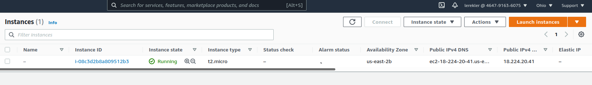
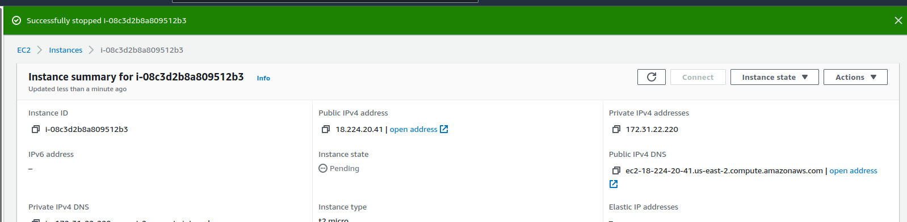
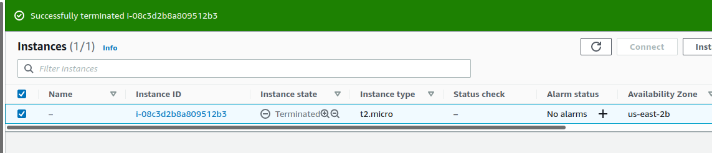

# Домашнее задание к занятию "7.2. Облачные провайдеры и синтаксис Terraform."

## Задача 1
### Регистрация в aws и знакомство с основами

```shell
$ aws configure list
      Name                    Value             Type    Location
      ----                    -----             ----    --------
   profile                <not set>             None    None
access_key     ****************XALR              env    
secret_key     ****************04XL              env    
    region               eu-north-1      config-file    ~/.aws/config
$ aws configure list-profiles
default
lerekler
```
* EC2:






### Вариант с Yandex.Cloud. Регистрация в aws и знакомство с основами 

* Прикреплю команду инициализации `terraform`:
```shell
$ sudo terraform init

Initializing the backend...

Initializing provider plugins...
- Finding yandex-cloud/yandex versions matching "0.61.0"...
- Installing yandex-cloud/yandex v0.61.0...
- Installed yandex-cloud/yandex v0.61.0 (self-signed, key ID E40F590B50BB8E40)

Partner and community providers are signed by their developers.
If you'd like to know more about provider signing, you can read about it here:
https://www.terraform.io/docs/cli/plugins/signing.html

Terraform has created a lock file .terraform.lock.hcl to record the provider
selections it made above. Include this file in your version control repository
so that Terraform can guarantee to make the same selections by default when
you run "terraform init" in the future.

Terraform has been successfully initialized!

You may now begin working with Terraform. Try running "terraform plan" to see
any changes that are required for your infrastructure. All Terraform commands
should now work.

If you ever set or change modules or backend configuration for Terraform,
rerun this command to reinitialize your working directory. If you forget, other
commands will detect it and remind you to do so if necessary.
```

## Задача 2. Созданием aws ec2 или yandex_compute_instance через терраформ.

-----------------------------------------------------------------
### AWS
* [main.tf](7.2ex/terraform_aws/aws/main.tf)
* [versions.tf](7.2ex/terraform_aws/aws/versions.tf)
* [output.tf](7.2ex/terraform_aws/aws/outputs.tf)
* [variables.tf](7.2ex/terraform_aws/aws/variables.tf)

* Глобальные переменные вынесла в `bashrc`
* Установленная версия `terraform` для `aws`:
```shell
$ terraform_aws version
Terraform v1.0.9
on linux_amd64
+ provider registry.terraform.io/hashicorp/aws v3.63.0
```
* `terraform init` и `terraform plan`
```shell
$ terraform_aws init

Initializing the backend...

Initializing provider plugins...
- Finding hashicorp/aws versions matching "~> 3.0"...
- Installing hashicorp/aws v3.63.0...
- Installed hashicorp/aws v3.63.0 (signed by HashiCorp)

Terraform has created a lock file .terraform.lock.hcl to record the provider
selections it made above. Include this file in your version control repository
so that Terraform can guarantee to make the same selections by default when
you run "terraform init" in the future.

Terraform has been successfully initialized!

You may now begin working with Terraform. Try running "terraform plan" to see
any changes that are required for your infrastructure. All Terraform commands
should now work.

If you ever set or change modules or backend configuration for Terraform,
rerun this command to reinitialize your working directory. If you forget, other
commands will detect it and remind you to do so if necessary.
```
```shell
lerekler@lerekler-Pavilion:~/terraform/aws $ terraform_aws plan

Terraform used the selected providers to generate the following execution plan. Resource actions are indicated
with the following symbols:
  + create

Terraform will perform the following actions:

  # aws_instance.web will be created
  + resource "aws_instance" "web" {
      + ami                                  = "ami-0358b49d1ab873c60"
      + arn                                  = (known after apply)
      + associate_public_ip_address          = (known after apply)
      + availability_zone                    = (known after apply)
      + cpu_core_count                       = (known after apply)
      + cpu_threads_per_core                 = (known after apply)
      + disable_api_termination              = (known after apply)
      + ebs_optimized                        = (known after apply)
      + get_password_data                    = false
      + host_id                              = (known after apply)
      + id                                   = (known after apply)
      + instance_initiated_shutdown_behavior = (known after apply)
      + instance_state                       = (known after apply)
      + instance_type                        = "t3.micro"
      + ipv6_address_count                   = (known after apply)
      + ipv6_addresses                       = (known after apply)
      + key_name                             = (known after apply)
      + monitoring                           = (known after apply)
      + outpost_arn                          = (known after apply)
      + password_data                        = (known after apply)
      + placement_group                      = (known after apply)
      + placement_partition_number           = (known after apply)
      + primary_network_interface_id         = (known after apply)
      + private_dns                          = (known after apply)
      + private_ip                           = (known after apply)
      + public_dns                           = (known after apply)
      + public_ip                            = (known after apply)
      + secondary_private_ips                = (known after apply)
      + security_groups                      = (known after apply)
      + source_dest_check                    = true
      + subnet_id                            = (known after apply)
      + tags                                 = {
          + "Name" = "HelloWorld"
        }
      + tags_all                             = {
          + "Name" = "HelloWorld"
        }
      + tenancy                              = (known after apply)
      + user_data                            = (known after apply)
      + user_data_base64                     = (known after apply)
      + vpc_security_group_ids               = (known after apply)

      + capacity_reservation_specification {
          + capacity_reservation_preference = (known after apply)

          + capacity_reservation_target {
              + capacity_reservation_id = (known after apply)
            }
        }

      + ebs_block_device {
          + delete_on_termination = (known after apply)
          + device_name           = (known after apply)
          + encrypted             = (known after apply)
          + iops                  = (known after apply)
          + kms_key_id            = (known after apply)
          + snapshot_id           = (known after apply)
          + tags                  = (known after apply)
          + throughput            = (known after apply)
          + volume_id             = (known after apply)
          + volume_size           = (known after apply)
          + volume_type           = (known after apply)
        }

      + enclave_options {
          + enabled = (known after apply)
        }

      + ephemeral_block_device {
          + device_name  = (known after apply)
          + no_device    = (known after apply)
          + virtual_name = (known after apply)
        }

      + metadata_options {
          + http_endpoint               = (known after apply)
          + http_put_response_hop_limit = (known after apply)
          + http_tokens                 = (known after apply)
        }

      + network_interface {
          + delete_on_termination = (known after apply)
          + device_index          = (known after apply)
          + network_interface_id  = (known after apply)
        }

      + root_block_device {
          + delete_on_termination = (known after apply)
          + device_name           = (known after apply)
          + encrypted             = (known after apply)
          + iops                  = (known after apply)
          + kms_key_id            = (known after apply)
          + tags                  = (known after apply)
          + throughput            = (known after apply)
          + volume_id             = (known after apply)
          + volume_size           = (known after apply)
          + volume_type           = (known after apply)
        }
    }

  # aws_vpc.example will be created
  + resource "aws_vpc" "example" {
      + arn                              = (known after apply)
      + assign_generated_ipv6_cidr_block = false
      + cidr_block                       = "10.0.0.0/16"
      + default_network_acl_id           = (known after apply)
      + default_route_table_id           = (known after apply)
      + default_security_group_id        = (known after apply)
      + dhcp_options_id                  = (known after apply)
      + enable_classiclink               = (known after apply)
      + enable_classiclink_dns_support   = (known after apply)
      + enable_dns_hostnames             = (known after apply)
      + enable_dns_support               = true
      + id                               = (known after apply)
      + instance_tenancy                 = "default"
      + ipv6_association_id              = (known after apply)
      + ipv6_cidr_block                  = (known after apply)
      + main_route_table_id              = (known after apply)
      + owner_id                         = (known after apply)
      + tags_all                         = (known after apply)
    }

Plan: 2 to add, 0 to change, 0 to destroy.

Changes to Outputs:
  + account_id         = "464791636075"
  + caller_arn         = "arn:aws:iam::464791636075:root"
  + caller_user        = "464791636075"
  + instance_id        = (known after apply)
  + instance_ip_addr   = (known after apply)
  + instance_public_ip = (known after apply)
```
* `terraform apply`
```shell
$ terraform_aws apply

Terraform used the selected providers to generate the following execution plan. Resource actions are
indicated with the following symbols:
  + create

Terraform will perform the following actions:

  # aws_instance.web will be created
  + resource "aws_instance" "web" {
      + ami                                  = "ami-0358b49d1ab873c60"
      + arn                                  = (known after apply)
      + associate_public_ip_address          = (known after apply)
      + availability_zone                    = (known after apply)
      + cpu_core_count                       = (known after apply)
      + cpu_threads_per_core                 = (known after apply)
      + disable_api_termination              = (known after apply)
      + ebs_optimized                        = (known after apply)
      + get_password_data                    = false
      + host_id                              = (known after apply)
      + id                                   = (known after apply)
      + instance_initiated_shutdown_behavior = (known after apply)
      + instance_state                       = (known after apply)
      + instance_type                        = "t3.micro"
      + ipv6_address_count                   = (known after apply)
      + ipv6_addresses                       = (known after apply)
      + key_name                             = (known after apply)
      + monitoring                           = (known after apply)
      + outpost_arn                          = (known after apply)
      + password_data                        = (known after apply)
      + placement_group                      = (known after apply)
      + placement_partition_number           = (known after apply)
      + primary_network_interface_id         = (known after apply)
      + private_dns                          = (known after apply)
      + private_ip                           = (known after apply)
      + public_dns                           = (known after apply)
      + public_ip                            = (known after apply)
      + secondary_private_ips                = (known after apply)
      + security_groups                      = (known after apply)
      + source_dest_check                    = true
      + subnet_id                            = (known after apply)
      + tags                                 = {
          + "Name" = "HelloWorld"
        }
      + tags_all                             = {
          + "Name" = "HelloWorld"
        }
      + tenancy                              = (known after apply)
      + user_data                            = (known after apply)
      + user_data_base64                     = (known after apply)
      + vpc_security_group_ids               = (known after apply)

      + capacity_reservation_specification {
          + capacity_reservation_preference = (known after apply)

          + capacity_reservation_target {
              + capacity_reservation_id = (known after apply)
            }
        }

      + ebs_block_device {
          + delete_on_termination = (known after apply)
          + device_name           = (known after apply)
          + encrypted             = (known after apply)
          + iops                  = (known after apply)
          + kms_key_id            = (known after apply)
          + snapshot_id           = (known after apply)
          + tags                  = (known after apply)
          + throughput            = (known after apply)
          + volume_id             = (known after apply)
          + volume_size           = (known after apply)
          + volume_type           = (known after apply)
        }

      + enclave_options {
          + enabled = (known after apply)
        }

      + ephemeral_block_device {
          + device_name  = (known after apply)
          + no_device    = (known after apply)
          + virtual_name = (known after apply)
        }

      + metadata_options {
          + http_endpoint               = (known after apply)
          + http_put_response_hop_limit = (known after apply)
          + http_tokens                 = (known after apply)
        }

      + network_interface {
          + delete_on_termination = (known after apply)
          + device_index          = (known after apply)
          + network_interface_id  = (known after apply)
        }

      + root_block_device {
          + delete_on_termination = (known after apply)
          + device_name           = (known after apply)
          + encrypted             = (known after apply)
          + iops                  = (known after apply)
          + kms_key_id            = (known after apply)
          + tags                  = (known after apply)
          + throughput            = (known after apply)
          + volume_id             = (known after apply)
          + volume_size           = (known after apply)
          + volume_type           = (known after apply)
        }
    }

  # aws_vpc.example will be created
  + resource "aws_vpc" "example" {
      + arn                              = (known after apply)
      + assign_generated_ipv6_cidr_block = false
      + cidr_block                       = "10.0.0.0/16"
      + default_network_acl_id           = (known after apply)
      + default_route_table_id           = (known after apply)
      + default_security_group_id        = (known after apply)
      + dhcp_options_id                  = (known after apply)
      + enable_classiclink               = (known after apply)
      + enable_classiclink_dns_support   = (known after apply)
      + enable_dns_hostnames             = (known after apply)
      + enable_dns_support               = true
      + id                               = (known after apply)
      + instance_tenancy                 = "default"
      + ipv6_association_id              = (known after apply)
      + ipv6_cidr_block                  = (known after apply)
      + main_route_table_id              = (known after apply)
      + owner_id                         = (known after apply)
      + tags_all                         = (known after apply)
    }

Plan: 2 to add, 0 to change, 0 to destroy.

Changes to Outputs:
  + account_id         = "464791636075"
  + caller_arn         = "arn:aws:iam::464791636075:root"
  + caller_user        = "464791636075"
  + instance_id        = (known after apply)
  + instance_ip_addr   = (known after apply)
  + instance_public_ip = (known after apply)

Do you want to perform these actions?
  Terraform will perform the actions described above.
  Only 'yes' will be accepted to approve.

  Enter a value: yes

aws_vpc.example: Creating...
aws_instance.web: Creating...
aws_vpc.example: Creation complete after 6s [id=vpc-08547d9d497b2e3c8]
aws_instance.web: Still creating... [10s elapsed]
aws_instance.web: Creation complete after 18s [id=i-064ea43e962e27908]

Apply complete! Resources: 2 added, 0 changed, 0 destroyed.

Outputs:

account_id = "****"
caller_arn = "arn:aws:iam::****:****"
caller_user = "****"
instance_id = "i-064ea43e9****7908"
instance_ip_addr = "172.31.6.163"
instance_public_ip = "3.70.185.191"

```
-----------------------------------------------------------------
### YANDEX
* С яндексом ознакомилась, но пока не уверена, что всё верно. `AWS` забрал много времени
* [main.tf](7.2ex/terraform_yandex/yandex/main.tf)
* Глобальные переменные вынесла в `bashrc`
* Установленная версия `terraform` для `yandex`:
```shell
$ terraform version
Terraform v1.0.8
on linux_amd64
+ provider registry.terraform.io/hashicorp/aws v3.63.0
```
* `terraform init` и `terraform plan`
```shell
$ terraform init

Initializing the backend...

Initializing provider plugins...
- Finding yandex-cloud/yandex versions matching "0.61.0"...
- Finding latest version of hashicorp/aws...
- Installing yandex-cloud/yandex v0.61.0...
- Installed yandex-cloud/yandex v0.61.0 (self-signed, key ID E40F590B50BB8E40)
- Installing hashicorp/aws v3.63.0...
- Installed hashicorp/aws v3.63.0 (signed by HashiCorp)

Partner and community providers are signed by their developers.
If you'd like to know more about provider signing, you can read about it here:
https://www.terraform.io/docs/cli/plugins/signing.html

Terraform has created a lock file .terraform.lock.hcl to record the provider
selections it made above. Include this file in your version control repository
so that Terraform can guarantee to make the same selections by default when
you run "terraform init" in the future.

Terraform has been successfully initialized!

You may now begin working with Terraform. Try running "terraform plan" to see
any changes that are required for your infrastructure. All Terraform commands
should now work.

If you ever set or change modules or backend configuration for Terraform,
rerun this command to reinitialize your working directory. If you forget, other
commands will detect it and remind you to do so if necessary.
```
```shell
$ terraform plan

Terraform used the selected providers to generate the following execution plan. Resource actions are indicated
with the following symbols:
  + create

Terraform will perform the following actions:

  # yandex_compute_image.foo-image will be created
  + resource "yandex_compute_image" "foo-image" {
      + created_at      = (known after apply)
      + folder_id       = (known after apply)
      + id              = (known after apply)
      + min_disk_size   = (known after apply)
      + name            = "my-custom-image"
      + os_type         = (known after apply)
      + product_ids     = (known after apply)
      + size            = (known after apply)
      + source_disk     = (known after apply)
      + source_family   = (known after apply)
      + source_image    = (known after apply)
      + source_snapshot = (known after apply)
      + source_url      = "https://storage.yandexcloud.net/lucky-images/kube-it.img"
      + status          = (known after apply)
    }

Plan: 1 to add, 0 to change, 0 to destroy.

```
-----------------------------------------------------------------

### Ответ на вопрос: при помощи какого инструмента (из разобранных на прошлом занятии) можно создать свой образ ami?

* CloudFormation
### Ссылки на конфигурации:

* [конфигурация aws](7.2ex/terraform_aws/aws)
* [конфигурация yandex](7.2ex/terraform_yandex/yandex)