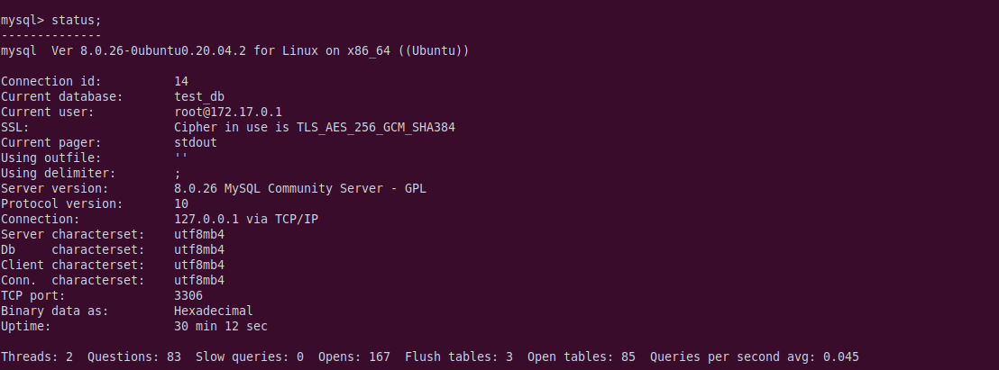
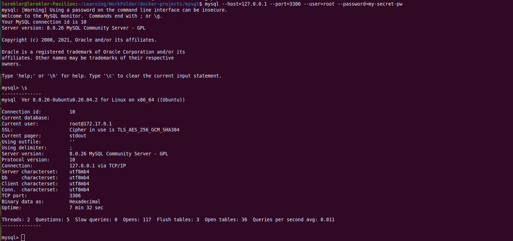
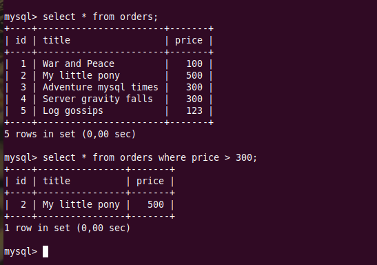

# Домашнее задание к занятию "6.3. MySQL"

## Задача 1

    Используя docker поднимите инстанс MySQL (версию 8). Данные БД сохраните в volume.
    Изучите бэкап БД и восстановитесь из него.
    Перейдите в управляющую консоль mysql внутри контейнера.
    Используя команду \h получите список управляющих команд.
    Найдите команду для выдачи статуса БД и приведите в ответе из ее вывода версию сервера БД.
    Подключитесь к восстановленной БД и получите список таблиц из этой БД.
    Приведите в ответе количество записей с price > 300.
    В следующих заданиях мы будем продолжать работу с данным контейнером.

* Заберем образ и запустим контейнер:
```shell
$ docker pull mysql:8
8: Pulling from library/mysql
Digest: sha256:99e0989e7e3797cfbdb8d51a19d32c8d286dd8862794d01a547651a896bcf00c
Status: Downloaded newer image for mysql:8
docker.io/library/mysql:8
lerekler@lerekler-Pavilion:~/Learning/WorkFolder/docker-projects/mysql$ docker volume create datamysql
datamysql
$ docker run --rm --name some-mysql -e MYSQL_ROOT_PASSWORD=my-secret-pw -dti -p 3306:3306 -v datamysql:/home/lerekler/Learning/WorkFolder/docker-projects/mysql/data mysql:8
781ddf27218cb8033b68d5e81d45de7239db1fb6b82c6aed2d69a88af7f02b95
$ docker ps
CONTAINER ID   IMAGE     COMMAND                  CREATED          STATUS         PORTS                                                  NAMES
781ddf27218c   mysql:8   "docker-entrypoint.s…"   10 seconds ago   Up 9 seconds   0.0.0.0:3306->3306/tcp, :::3306->3306/tcp, 33060/tcp   some-mysql
```
* Подключимся к серверу. Сразу замечу, что при подключении `mysql` поведал нам системную информацию, в которой упоминается версия сервера `Server version:		8.0.26 MySQL Community Server - GPL`
* Вывод команды `status` оставлю в скрине, остальное в `shell`:


```shell
$ mysql --host=localhost --port=3306 --user=root --password=my-secret-pw
mysql: [Warning] Using a password on the command line interface can be insecure.
Welcome to the MySQL monitor.  Commands end with ; or \g.
Your MySQL connection id is 10
Server version: 8.0.26 MySQL Community Server - GPL

Copyright (c) 2000, 2021, Oracle and/or its affiliates.

Oracle is a registered trademark of Oracle Corporation and/or its
affiliates. Other names may be trademarks of their respective
owners.

Type 'help;' or '\h' for help. Type '\c' to clear the current input statement.

mysql> \s
--------------
mysql  Ver 8.0.26-0ubuntu0.20.04.2 for Linux on x86_64 ((Ubuntu))

Connection id:		10
Current database:	
Current user:		root@172.17.0.1
SSL:			Cipher in use is TLS_AES_256_GCM_SHA384
Current pager:		stdout
Using outfile:		''
Using delimiter:	;
Server version:		8.0.26 MySQL Community Server - GPL
Protocol version:	10
Connection:		localhost via TCP/IP
Server characterset:	utf8mb4
Db     characterset:	utf8mb4
Client characterset:	utf8mb4
Conn.  characterset:	utf8mb4
TCP port:		3306
Binary data as:		Hexadecimal
Uptime:			7 min 32 sec

Threads: 2  Questions: 5  Slow queries: 0  Opens: 117  Flush tables: 3  Open tables: 36  Queries per second avg: 0.011
--------------
```


* Создадим тестовую БД:
```shell
mysql> CREATE DATABASE test_db;
Query OK, 1 row affected (0,01 sec)
mysql> show databases;
+--------------------+
| Database           |
+--------------------+
| information_schema |
| mysql              |
| performance_schema |
| sys                |
| test_db            |
+--------------------+
5 rows in set (0,01 sec)

```
* Выйдем из `mysql` и восстановимся из `dump`:
```shell
$ docker exec -i some-mysql sh -c 'exec mysql -uroot -p"$MYSQL_ROOT_PASSWORD" --database=test_db' -d test_db < test_dump.sql
mysql: [Warning] Using a password on the command line interface can be insecure.
```
* Посмотрим, что у нас в контейнере:
```shell
mysql --host=localhost --port=3306 --user=root --password=my-secret-pw
mysql: [Warning] Using a password on the command line interface can be insecure.
Welcome to the MySQL monitor.  Commands end with ; or \g.


mysql> use test_db;
Reading table information for completion of table and column names
You can turn off this feature to get a quicker startup with -A

Database changed
mysql> show tables;
+-------------------+
| Tables_in_test_db |
+-------------------+
| orders            |
+-------------------+
1 row in set (0,00 sec)

mysql> 
```
* Запросы к базе:



## Задача 2

    Создайте пользователя test в БД c паролем test-pass, используя:
        -   плагин авторизации mysql_native_password
        -   срок истечения пароля - 180 дней
        -   количество попыток авторизации - 3
        -   максимальное количество запросов в час - 100
        -   аттрибуты пользователя:
            -   Фамилия "Pretty"
            -   Имя "James"
        -   Предоставьте привелегии пользователю test на операции SELECT базы test_db.
    Используя таблицу INFORMATION_SCHEMA.USER_ATTRIBUTES получите данные по пользователю test и приведите в ответе к задаче.


```shell
mysql> CREATE USER 'test'@'localhost'
    -> IDENTIFIED WITH mysql_native_password
    -> BY 'test-pass';
Query OK, 0 rows affected (0,02 sec)

mysql> ALTER USER 'test'@'localhost' ATTRIBUTE '{"fname":"James", "lname":"Pretty"}';
Query OK, 0 rows affected (0,01 sec)

mysql> ALTER USER 'test'@'localhost'
    -> IDENTIFIED BY 'test-pass'
    -> WITH MAX_QUERIES_PER_HOUR 100
    -> PASSWORD EXPIRE INTERVAL 180 DAY;
Query OK, 0 rows affected (0,01 sec)

mysql> ALTER USER 'test'@'localhost'
    -> IDENTIFIED BY 'test-pass'
    -> FAILED_LOGIN_ATTEMPTS 3 PASSWORD_LOCK_TIME 2;
Query OK, 0 rows affected (0,01 sec)
mysql> GRANT SELECT ON test_db.* TO 'test'@'localhost';
Query OK, 0 rows affected (0,01 sec)
```
* Вывод по `INFORMATION_SCHEMA.USER_ATTRIBUTES`:
```shell
mysql> select * from INFORMATION_SCHEMA.USER_ATTRIBUTES where user = 'test';
+------+-----------+---------------------------------------+
| USER | HOST      | ATTRIBUTE                             |
+------+-----------+---------------------------------------+
| test | localhost | {"fname": "James", "lname": "Pretty"} |
+------+-----------+---------------------------------------+
1 row in set (0,00 sec)
```

## Задача 3

    Установите профилирование SET profiling = 1. Изучите вывод профилирования команд SHOW PROFILES;.    
    Исследуйте, какой engine используется в таблице БД test_db и приведите в ответе.    
    Измените engine и приведите время выполнения и запрос на изменения из профайлера в ответе:    
        -   на MyISAM
        -   на InnoDB
* Engine:
```shell
mysql> SELECT table_schema, table_name, engine FROM INFORMATION_SCHEMA.TABLES WHERE table_schema = 'test_db' AND table_name = 'orders';
+--------------+------------+--------+
| TABLE_SCHEMA | TABLE_NAME | ENGINE |
+--------------+------------+--------+
| test_db      | orders     | InnoDB |
+--------------+------------+--------+
1 row in set (0,00 sec)
```

* Переключение на разные движки:
```shell
mysql> ALTER TABLE orders ENGINE = MyISAM;
Query OK, 5 rows affected (0,03 sec)
Records: 5  Duplicates: 0  Warnings: 0

mysql> ALTER TABLE orders ENGINE = InnoDB;
Query OK, 5 rows affected (0,08 sec)
Records: 5  Duplicates: 0  Warnings: 0
```
* Profiles:
```shell
mysql> SHOW PROFILES;
+----------+------------+---------------------------------------------------------------------------------------------------------------------------------+
| Query_ID | Duration   | Query                                                                                                                           |
+----------+------------+---------------------------------------------------------------------------------------------------------------------------------+
|        1 | 0.13673650 | SELECT * FROM INFORMATION_SCHEMA.TABLES                                                                                         |
|        2 | 0.00187025 | SELECT table_schema, table_name, engine FROM INFORMATION_SCHEMA.TABLES WHERE TABLE_SCHEMA = 'test_db' AND TABLE_NAME = 'orders' |
|        3 | 0.03156775 | ALTER TABLE orders ENGINE = MyISAM                                                                                              |
|        4 | 0.07907300 | ALTER TABLE orders ENGINE = InnoDB                                                                                              |
+----------+------------+---------------------------------------------------------------------------------------------------------------------------------+
4 rows in set, 1 warning (0,00 sec)
```
* *Переключение на `MyISAM` заняло 0,03 сек*
* *Переключение на `InnoDB` заняло 0,08 сек*

## Задача 4

    Изучите файл my.cnf в директории /etc/mysql.    
    Измените его согласно ТЗ (движок InnoDB):    
        -   Скорость IO важнее сохранности данных
        -   Нужна компрессия таблиц для экономии места на диске
        -   Размер буффера с незакомиченными транзакциями 1 Мб
        -   Буффер кеширования 30% от ОЗУ
        -   Размер файла логов операций 100 Мб
    Приведите в ответе измененный файл my.cnf.

* Файл: [my.cnf](container-my.cnf)
* Изменения по задаче:
```shell
# Скорость IO важнее сохранности данных
innodb_flush_log_at_trx_commit	=	0

# Нужна компрессия таблиц для экономии места на диске
innodb_file_per_table	=	ON

# Размер буффера с незакомиченными транзакциями 1 Мб
innodb_log_buffer_size	=	1M

# Буффер кеширования 30% от ОЗУ (ОЗУ 32GB, 9 GB многовато, думаю =))
innodb_buffer_pool_size = 3G

# Размер файла логов операций 100 Мб
innodb_log_file_size = 100M
```
