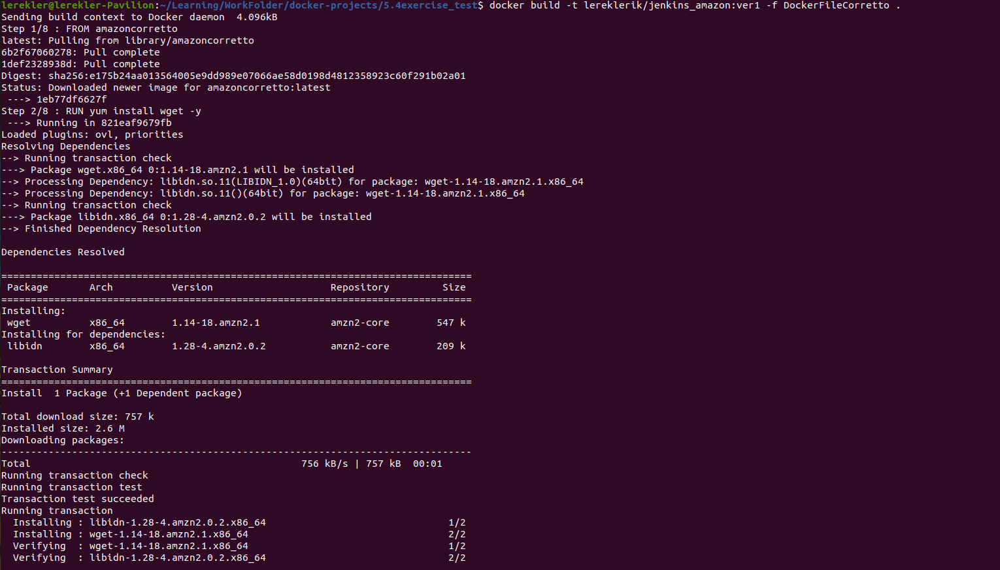

# Домашнее задание к занятию "5.4. Практические навыки работы с Docker"

## Задача 1

    В данном задании вы научитесь изменять существующие Dockerfile, адаптируя их под нужный инфраструктурный стек.
    Измените базовый образ предложенного Dockerfile на Arch Linux c сохранением его функциональности.
    
```shell
FROM ubuntu:latest

RUN apt-get update && \
    apt-get install -y software-properties-common && \
    add-apt-repository ppa:vincent-c/ponysay && \
    apt-get update
 
RUN apt-get install -y ponysay

ENTRYPOINT ["/usr/bin/ponysay"]
CMD ["Hey, netology”]
```


* DockerFile:
```shell
FROM archlinux:latest
RUN yes | pacman -Syu -y && \
	yes	| pacman -Syu ponysay -y && \
	yes | pacman -Syu -y
ENTRYPOINT ["/usr/bin/ponysay"]
CMD ["Hey, netology”]
```
* Запуск образа:
```shell
docker build -t archpony .
Sending build context to Docker daemon  2.048kB
Step 1/4 : FROM archlinux:latest
latest: Pulling from library/archlinux
adb45d044f8e: Pull complete 
...
Successfully built efada910435b
Successfully tagged archpony:latest
```
* Запуск контейнера:
```shell
docker run -ti --name ponystart archpony:latest
```
* Результат: 

* P.S. вышло очень символично, что пони в медицинской шапочке, т.к. с `archlinux` намучилась и хотелось вызвать санитаров)

* Запушим образ:
```shell
lerekler@lerekler-Pavilion:~/Learning/WorkFolder/docker-projects/5.4exercise_test$ docker tag efada910435b lereklerik/ponysay-netology:latest
lerekler@lerekler-Pavilion:~/Learning/WorkFolder/docker-projects/5.4exercise_test$ docker images
REPOSITORY                    TAG       IMAGE ID       CREATED         SIZE
lereklerik/ponysay-netology   latest    efada910435b   9 minutes ago   541MB
acrhpony                      latest    efada910435b   9 minutes ago   541MB
lereklerik                    latest    efada910435b   9 minutes ago   541MB
archlinux                     latest    1d6f90387c13   2 weeks ago     381MB
hello-world                   latest    d1165f221234   6 months ago    13.3kB
lerekler@lerekler-Pavilion:~/Learning/WorkFolder/docker-projects/5.4exercise_test$ docker push lereklerik/ponysay-netology:latest
The push refers to repository [docker.io/lereklerik/ponysay-netology]
4cb3be438a7a: Pushed 
1f3b1c7bc202: Mounted from library/archlinux 
959ee6191ad6: Mounted from library/archlinux 
latest: digest: sha256:0bd01ff424016cbadbcef9fb2a1da9b4793a7dfc7c39935d22032fd141685b31 size: 950
```
* Ссылка на тег: [ponysay:latest](https://hub.docker.com/repository/registry-1.docker.io/lereklerik/ponysay-netology/tags?page=1&ordering=last_updated)
* Pull: docker pull lereklerik/ponysay-netology

## Задача 2

    В данной задаче вы составите несколько разных Dockerfile для проекта Jenkins, опубликуем образ в dockerhub.io и посмотрим логи этих контейнеров.
    1. Составьте 2 Dockerfile:
        1.1. Общие моменты:
                Образ должен запускать Jenkins server
        1.2. Спецификация первого образа:
                Базовый образ - amazoncorreto
                Присвоить образу тэг ver1
        1.3. Спецификация второго образа:    
                Базовый образ - ubuntu:latest
                Присвоить образу тэг ver2
    2.Соберите 2 образа по полученным Dockerfile    
    3.Запустите и проверьте их работоспособность    
    4.Опубликуйте образы в своём dockerhub.io хранилище    
    
    Для получения зачета, вам необходимо предоставить:    
        Наполнения 2х Dockerfile из задания
        Скриншоты логов запущенных вами контейнеров (из командной строки)
        Скриншоты веб-интерфейса Jenkins запущенных вами контейнеров (достаточно 1 скриншота на контейнер)
        Ссылки на образы в вашем хранилище docker-hub
----------------------------------------------------------
#### AMAZONCORRETTO
* DockerFile для `amazoncorretto`:
```shell
FROM amazoncorretto

RUN yum install wget -y
RUN wget -O /etc/yum.repos.d/jenkins.repo \
	https://pkg.jenkins.io/redhat-stable/jenkins.repo
RUN rpm --import https://pkg.jenkins.io/redhat-stable/jenkins.io.key
RUN yum upgrade	
RUN yum install https://dl.fedoraproject.org/pub/epel/epel-release-latest-7.noarch.rpm -y
RUN	yum install java-1.8.0-openjdk -y && \
    yum install jenkins -y
CMD ["/bin/bash"]
```

```shell
$ docker build -t lereklerik/jenkins_amazon:ver1 -f DockerFileCorretto .
```

```shell
$ docker run -p 8081:8080 -p 50001:50000 -w /usr/lib/jenkins/ -ti lereklerik/jenkins_amazon:ver1 java -jar jenkins.war
```

* Результат:


* Ссылка на тег: [amazon_jenkins_tag](https://hub.docker.com/repository/docker/lereklerik/jenkins_amazon/tags?page=1&ordering=last_updated)
* Pull: docker pull lereklerik/jenkins_amazon

---------------------------------------------------------------------

#### UBUNTU

* DockerFile:
```shell
FROM ubuntu:latest

RUN apt update && apt install wget -y
RUN apt install gnupg -y
RUN wget -q -O - https://pkg.jenkins.io/debian-stable/jenkins.io.key | apt-key add -
RUN sh -c 'echo deb https://pkg.jenkins.io/debian-stable binary/ > /etc/apt/sources.list.d/jenkins.list'
RUN apt update && apt install openjdk-8-jdk -y
RUN apt update && apt install jenkins -y
CMD ["/bin/bash"]
```
* Запуск:
```shell
$ docker build -t lereklerik/jenkins_ubuntu:ver2 -f DockerFileUbuntu .
...
 ---> d14a35d9f902
Successfully built d14a35d9f902
Successfully tagged lereklerik/jenkins_ubuntu:ver2
```


```shell
docker run -p 8082:8080 -p 50002:50000 -w /usr/share/jenkins/ -ti lereklerik/jenkins_ubuntu:ver2 java -jar jenkins.war
Running from: /usr/share/jenkins/jenkins.war
webroot: $user.home/.jenkins
```


* Результат:


P.S. Донастраивать jenkins с ubuntu не буду, т.к. это достаточно долго + по amazon первую страницу с ним продемонстрировала

* Ссылка на тег: [ubuntu_jenkins_tag](https://hub.docker.com/repository/docker/lereklerik/jenkins_ubuntu/tags?page=1&ordering=last_updated)
* Pull: docker pull lereklerik/jenkins_ubuntu

## Задача 3

    В данном задании вы научитесь:
    
    объединять контейнеры в единую сеть
    исполнять команды "изнутри" контейнера
    Для выполнения задания вам нужно:
    
    1. Написать Dockerfile:    
        1.1. Использовать образ https://hub.docker.com/_/node как базовый
        1.2. Установить необходимые зависимые библиотеки для запуска npm приложения https://github.com/simplicitesoftware/nodejs-demo
        1.3. Выставить у приложения (и контейнера) порт 3000 для прослушки входящих запросов
        1.4. Соберите образ и запустите контейнер в фоновом режиме с публикацией порта`
    2. Запустить второй контейнер из образа ubuntu:latest    
    3. Создайть docker network и добавьте в нее оба запущенных контейнера    
    4. Используя docker exec запустить командную строку контейнера ubuntu в интерактивном режиме    
    5. Используя утилиту curl вызвать путь / контейнера с npm приложением

* DockerFile:
```shell
FROM node:latest

RUN apt update
RUN git clone https://github.com/simplicitesoftware/nodejs-demo.git
WORKDIR  /nodejs-demo/
RUN npm install -g nodemon
RUN npm install -g npm@7.23.0
RUN npm install -y
RUN npm install -g npm@7.23.0
RUN sed -i "s/localhost/0.0.0.0/g" app.js
EXPOSE 3000
CMD [ "npm", "start"]
```
_P.S. Конечно, файл дорабатывался много раз, т.к. приходилось читать логи запуска докера, и понять, почему curl сразу не хотел работать. Пришлось также запускать контейнер с nodejs-demo отдельно, рассматривать файлы и понять, что с localhost в app.js ответа мы не получим_

* Запуск образа:
```shell
$ docker build -t lereklerik/nodejs -f DockerFileNode .
Sending build context to Docker daemon   5.12kB
Step 1/11 : FROM node:latest
latest: Pulling from library/node
8f04e8168e38: Pull complete 
82e5f66f5d0e: Pull complete 
c1c8f1c77d66: Pull complete 
5095cab27771: Pull complete 
ea7fe362a971: Pull complete 
9000ed6ad541: Pull complete 
79733a3c6015: Pull complete 
10da8f37aebc: Pull complete 
4641fca333ab: Pull complete 
Digest: sha256:8710efa3fc8be1cbce674c646c1c64a993a70ca767bd56bae81e232855261973
```
* Запуск контейнера:
```shell
$ docker run -d -p 3000:3000 --net=bridge lereklerik/nodejs npm start
d8bb6b508a1929bb0fc48020072a6f7825d46e5cd59a7783686f19fa024125b2
```
* Стартуем контейнер с `ubuntu`, подготовим его к работе с `curl`:
```shell
$ docker run -ti ubuntu bash
root@a7ed7155c3af:/# apt-get update
root@a7ed7155c3af:/# apt-get install curl -y
```
* Наши контейнеры:
```shell
$ docker ps
CONTAINER ID   IMAGE               COMMAND                  CREATED              STATUS              PORTS                                       NAMES
a7ed7155c3af   ubuntu              "bash"                   About a minute ago   Up About a minute                                               loving_lamport
d8bb6b508a19   lereklerik/nodejs   "docker-entrypoint.s…"   About a minute ago   Up About a minute   0.0.0.0:3000->3000/tcp, :::3000->3000/tcp   reverent_wiles
```
* Список сетей:

* Просмотр нашей сети:

```shell
lerekler@lerekler-Pavilion:~/Learning/WorkFolder/docker-projects/5.4exercise_test$ docker network inspect bridge
[
    {
        "Name": "bridge",
        "Id": "01cdfc109fce328e605d2776acaa8dffec029a35d8ae98ca20bde7394932fd09",
        "Created": "2021-09-16T10:39:23.351280239+03:00",
        "Scope": "local",
        "Driver": "bridge",
        "EnableIPv6": false,
        "IPAM": {
            "Driver": "default",
            "Options": null,
            "Config": [
                {
                    "Subnet": "172.17.0.0/16",
                    "Gateway": "172.17.0.1"
                }
            ]
        },
        "Internal": false,
        "Attachable": false,
        "Ingress": false,
        "ConfigFrom": {
            "Network": ""
        },
        "ConfigOnly": false,
        "Containers": {
            "a7ed7155c3af18b3202efd4ed706b0b2dc108de53756d7a404a3764886734a88": {
                "Name": "loving_lamport",
                "EndpointID": "37d87daf5563e9604f285534922e4ea3263405da9af0b57c32a837cb0fb7fdef",
                "MacAddress": "02:42:ac:11:00:03",
                "IPv4Address": "172.17.0.3/16",
                "IPv6Address": ""
            },
            "d8bb6b508a1929bb0fc48020072a6f7825d46e5cd59a7783686f19fa024125b2": {
                "Name": "reverent_wiles",
                "EndpointID": "1bf1cf11054b590c7c7c55da5a8d041fa664a07b30f01e6ae6893d70f27aa299",
                "MacAddress": "02:42:ac:11:00:02",
                "IPv4Address": "172.17.0.2/16",
                "IPv6Address": ""
            }
        },
        "Options": {
            "com.docker.network.bridge.default_bridge": "true",
            "com.docker.network.bridge.enable_icc": "true",
            "com.docker.network.bridge.enable_ip_masquerade": "true",
            "com.docker.network.bridge.host_binding_ipv4": "0.0.0.0",
            "com.docker.network.bridge.name": "docker0",
            "com.docker.network.driver.mtu": "1500"
        },
        "Labels": {}
    }
]
```
* Вызов `curl` в `ubuntu`:
```shell
root@a7ed7155c3af:/# curl 172.17.0.2:3000/
<!DOCTYPE html><html lang="en"><head><title>Node.js demo</title><meta charset="utf-8"><meta http-equiv="X-UA-Compatible" content="IE=edge"><meta name="viewport" content="width=device-width, initial-scale=1, maximum-scale=1, user-scalable=0"><link rel="shortcut icon" href="/favicon.png"><link rel="stylesheet" href="/index.css"><script type="text/javascript" src="/jquery.js"></script><script type="text/javascript">$(document).ready(function() {
```


* Ссылка на тег: [nodeja_tags](https://hub.docker.com/repository/docker/lereklerik/nodejs/tags?page=1&ordering=last_updated)
* Pull: docker pull lereklerik/nodejs