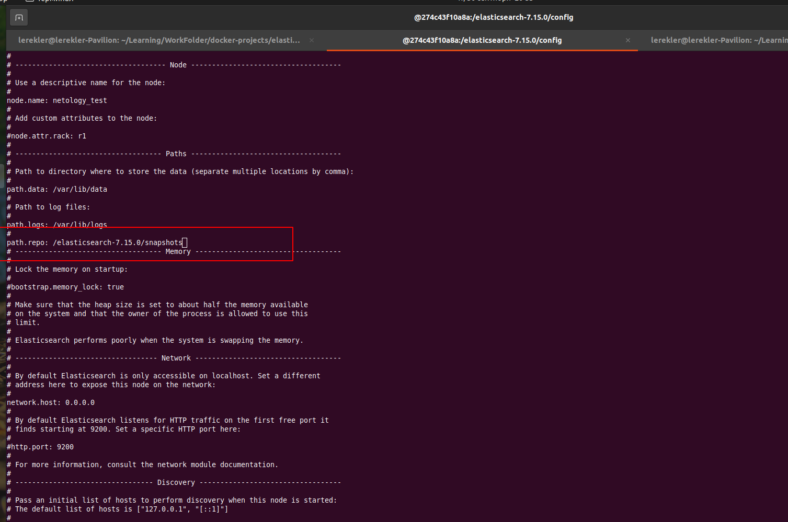

# Домашнее задание к занятию "6.5. Elasticsearch"

## Задача 1

--------------------------------------------------------------------------------------------
    Используя докер образ centos:7 как базовый и документацию по установке и запуску Elastcisearch:
        -   составьте Dockerfile-манифест для elasticsearch
        -   соберите docker-образ и сделайте push в ваш docker.io репозиторий
        -   запустите контейнер из получившегося образа и выполните запрос пути / c хост-машины
    Требования к elasticsearch.yml:
        -   данные path должны сохраняться в /var/lib
        -   имя ноды должно быть netology_test
--------------------------------------------------------------------------------------------

#### Составьте Dockerfile-манифест для elasticsearch
* Dockerfile:
```shell
FROM centos:7

RUN yum update -y && \
	yum install wget -y && \
	yum install java-11-openjdk-devel -y && \
	wget https://artifacts.elastic.co/downloads/elasticsearch/elasticsearch-7.15.0-linux-x86_64.tar.gz && \
	wget https://artifacts.elastic.co/downloads/elasticsearch/elasticsearch-7.15.0-linux-x86_64.tar.gz.sha512 && \
	yum install perl-Digest-SHA -y && \
	shasum -a 512 -c elasticsearch-7.15.0-linux-x86_64.tar.gz.sha512 && \
	yum upgrade -y && \
	tar -xzf elasticsearch-7.15.0-linux-x86_64.tar.gz && \
	mkdir /var/lib/logs && mkdir /var/lib/data

ADD elasticsearch.yml /elasticsearch-7.15.0/config/

ENV ES_HOME=/elasticsearch-7.15.0

RUN groupadd elsearch && useradd elsearch -g elsearch -p elasticsearch && \
	chown -R elsearch:elsearch elasticsearch-7.15.0/ && \
	chown elsearch:elsearch /var/lib/data && \
	chown elsearch:elsearch /var/lib/logs

USER elsearch

CMD ["/usr/sbin/init"]

CMD ["elasticsearch-7.15.0/bin/elasticsearch"]
```
--------------------------------------------------------------------------------------------
#### Соберите docker-образ и сделайте push в ваш docker.io репозиторий
* Образ: [elasticsearch](https://hub.docker.com/repository/docker/lereklerik/elastic-netology)
* [elasticsearch.yml](elasticsearch.yml)
--------------------------------------------------------------------------------------------

#### Запустите контейнер из получившегося образа и выполните запрос пути / c хост-машины

```shell
$ curl -XGET localhost:9200/
```
```json
{
  "name" : "netology_test",
  "cluster_name" : "netology-app",
  "cluster_uuid" : "tlaTx46qSSqc8aMEeYbRwQ",
  "version" : {
    "number" : "7.15.0",
    "build_flavor" : "default",
    "build_type" : "tar",
    "build_hash" : "79d65f6e357953a5b3cbcc5e2c7c21073d89aa29",
    "build_date" : "2021-09-16T03:05:29.143308416Z",
    "build_snapshot" : false,
    "lucene_version" : "8.9.0",
    "minimum_wire_compatibility_version" : "6.8.0",
    "minimum_index_compatibility_version" : "6.0.0-beta1"
  },
  "tagline" : "You Know, for Search"
}
```

## Задача 2

--------------------------------------------------------------------------------------------
    -   Ознакомьтесь с документацией и добавьте в elasticsearch 3 индекса
    -   Получите список индексов и их статусов, используя API и приведите в ответе на задание.
    -   Получите состояние кластера elasticsearch, используя API.
    -   Как вы думаете, почему часть индексов и кластер находится в состоянии yellow?
    -   Удалите все индексы.

--------------------------------------------------------------------------------------------
#### Добавьте в elasticsearch 3 индекса
* Создание индексов
```shell
$ curl -XPUT localhost:9200/ind-1 -H 'Content-Type: application/json' -d '{"settings": {"number_of_shards": 1, "number_of_replicas": 0}}'
{"acknowledged":true,"shards_acknowledged":true,"index":"ind-1"}
$ curl -XPUT localhost:9200/ind-2 -H 'Content-Type: application/json' -d '{"settings": {"number_of_shards": 2, "number_of_replicas": 1}}'
{"acknowledged":true,"shards_acknowledged":true,"index":"ind-2"}
$ curl -XPUT localhost:9200/ind-3 -H 'Content-Type: application/json' -d '{"settings": {"number_of_shards": 4, "number_of_replicas": 2}}'
{"acknowledged":true,"shards_acknowledged":true,"index":"ind-3"}
```
--------------------------------------------------------------------------------------------
#### Получите список индексов и их статусов, используя API и приведите в ответе на задание.

* Список индексов и их состояние:
```shell
$ curl -XGET localhost:9200/_cat/indices/ind*?v
health status index uuid                   pri rep docs.count docs.deleted store.size pri.store.size
green  open   ind-1 KY1L5PUgQQ6IjI3-sWGzqw   1   0          0            0       208b           208b
yellow open   ind-3 6I9O6x2GRKydrVPUm7-38g   4   2          0            0       832b           832b
yellow open   ind-2 vEa8rvM0QDCYLwYWJIB39w   2   1          0            0       416b           416b
```
--------------------------------------------------------------------------------------------
#### Получите состояние кластера elasticsearch, используя API.
* Состояние кластера:
```shell
$ curl -XGET localhost:9200/_cluster/health/ind*?pretty
{
  "cluster_name" : "netology-app",
  "status" : "yellow",
  "timed_out" : false,
  "number_of_nodes" : 1,
  "number_of_data_nodes" : 1,
  "active_primary_shards" : 7,
  "active_shards" : 7,
  "relocating_shards" : 0,
  "initializing_shards" : 0,
  "unassigned_shards" : 10,
  "delayed_unassigned_shards" : 0,
  "number_of_pending_tasks" : 0,
  "number_of_in_flight_fetch" : 0,
  "task_max_waiting_in_queue_millis" : 0,
  "active_shards_percent_as_number" : 44.44444444444444
}
```
--------------------------------------------------------------------------------------------
#### Как вы думаете, почему часть индексов и кластер находится в состоянии yellow?
* Статус `yellow` кластера говорит о том, что _все primary шарды в состоянии assigned. Часть secondary - шард в состоянии unassigned_. Проверим состояние индексов в кластере:
* `ind-1`:
```shell
$ curl -XGET localhost:9200/_cluster/health/ind-1?pretty
{
  "cluster_name" : "netology-app",
  "status" : "green",
  "timed_out" : false,
  "number_of_nodes" : 1,
  "number_of_data_nodes" : 1,
  "active_primary_shards" : 1,
  "active_shards" : 1,
  "relocating_shards" : 0,
  "initializing_shards" : 0,
  "unassigned_shards" : 0,        ## нет не назначенных шардов
  "delayed_unassigned_shards" : 0,
  "number_of_pending_tasks" : 0,
  "number_of_in_flight_fetch" : 0,
  "task_max_waiting_in_queue_millis" : 0,
  "active_shards_percent_as_number" : 100.0
}
```
* `ind-2`:
```shell
$ curl -XGET localhost:9200/_cluster/health/ind-2?pretty
{
  "cluster_name" : "netology-app",
  "status" : "yellow",
  "timed_out" : false,
  "number_of_nodes" : 1,
  "number_of_data_nodes" : 1,
  "active_primary_shards" : 2,
  "active_shards" : 2,
  "relocating_shards" : 0,
  "initializing_shards" : 0,
  "unassigned_shards" : 2,      ## два не назначенных шарда
  "delayed_unassigned_shards" : 0,
  "number_of_pending_tasks" : 0,
  "number_of_in_flight_fetch" : 0,
  "task_max_waiting_in_queue_millis" : 0,
  "active_shards_percent_as_number" : 44.44444444444444
}
```
* `ind-3`:
```shell
$ curl -XGET localhost:9200/_cluster/health/ind-3?pretty
{
  "cluster_name" : "netology-app",
  "status" : "yellow",
  "timed_out" : false,
  "number_of_nodes" : 1,
  "number_of_data_nodes" : 1,
  "active_primary_shards" : 4,
  "active_shards" : 4,
  "relocating_shards" : 0,
  "initializing_shards" : 0,
  "unassigned_shards" : 8,    ## восемь не назначенных шардов
  "delayed_unassigned_shards" : 0,
  "number_of_pending_tasks" : 0,
  "number_of_in_flight_fetch" : 0,
  "task_max_waiting_in_queue_millis" : 0,
  "active_shards_percent_as_number" : 44.44444444444444
}
```
* Посмотрим состояние шардов:
```shell
$ curl -XGET localhost:9200/_cat/shards/ind*?pretty
ind-1 0 p STARTED    0 208b 172.17.0.2 netology_test
ind-3 3 p STARTED    0 208b 172.17.0.2 netology_test
ind-3 3 r UNASSIGNED                   
ind-3 3 r UNASSIGNED                   
ind-3 1 p STARTED    0 208b 172.17.0.2 netology_test
ind-3 1 r UNASSIGNED                   
ind-3 1 r UNASSIGNED                   
ind-3 2 p STARTED    0 208b 172.17.0.2 netology_test
ind-3 2 r UNASSIGNED                   
ind-3 2 r UNASSIGNED                   
ind-3 0 p STARTED    0 208b 172.17.0.2 netology_test
ind-3 0 r UNASSIGNED                   
ind-3 0 r UNASSIGNED                   
ind-2 1 p STARTED    0 208b 172.17.0.2 netology_test
ind-2 1 r UNASSIGNED                   
ind-2 0 p STARTED    0 208b 172.17.0.2 netology_test
ind-2 0 r UNASSIGNED                   
```
---------------------------------------
##### _Получается, что шарды нам доступны, а вот реплики - нет. Значит, данные могут быть потеряны. А куда реплицировать данные мы не указали._

--------------------------------------------------------------------------------------------

#### Удалите индексы

```shell
$ curl -XDELETE localhost:9200/ind*?pretty
{
  "acknowledged" : true
}
```
* Проверка:
 ```shell
$ curl -XGET localhost:9200/_cat/indices/ind*?v
health status index uuid pri rep docs.count docs.deleted store.size pri.store.size
```

## Задача 3

--------------------------------------------------------------------------------------------
    -   Создайте директорию {путь до корневой директории с elasticsearch в образе}/snapshots.
    -   Используя API зарегистрируйте данную директорию как snapshot repository c именем netology_backup.
    -   Приведите в ответе запрос API и результат вызова API для создания репозитория.
    -   Создайте индекс test с 0 реплик и 1 шардом и приведите в ответе список индексов.
    -   Создайте snapshot состояния кластера elasticsearch.
    -   Приведите в ответе список файлов в директории со snapshotами.
    -   Удалите индекс test и создайте индекс test-2. Приведите в ответе список индексов.
    -   Восстановите состояние кластера elasticsearch из snapshot, созданного ранее.
    -   Приведите в ответе запрос к API восстановления и итоговый список индексов.
--------------------------------------------------------------------------------------------
#### Создайте директорию {путь до корневой директории с elasticsearch в образе}/snapshots.

* Остановила контейнер с `elasticsearch` и собрала новый, перейдя в интерактивный режим:
```shell
$ docker run -it --name elastic_test lereklerik/elastic-netology:second /bin/bash
```
* Изменила конфигурационный файл:



* Закомитила изменения, создав новый образ:
```shell
$ docker ps
CONTAINER ID   IMAGE                                COMMAND       CREATED         STATUS         PORTS     NAMES
274c43f10a8a   lereklerik/elastic-netology:second   "/bin/bash"   6 minutes ago   Up 6 minutes             elastic_test
$ docker commit -m "Change elasticsearch.yml" elastic_test lereklerik/elastic-netology:third
sha256:db8ac2093c06d894fd5c56fb2cc665341c39bc52f112f3c5f7a29a3357289fa7
$ docker images
REPOSITORY                    TAG       IMAGE ID       CREATED             SIZE
lereklerik/elastic-netology   third     db8ac2093c06   3 minutes ago       2.19GB
lereklerik/elastic-netology   second    a45cb058149b   About an hour ago   2.19GB
centos                        7         eeb6ee3f44bd   2 weeks ago         204MB
```
* Запустила новый контейнер:
```shell
$ docker run -it  --name elastic_snapshots -p 9200:9200 -p 9300:9300 -e "discovery.type=single-node" lereklerik/elastic-netology:third elasticsearch-7.15.0/bin/elasticsearch
```
--------------------------------------------------------------------------------------------

#### Используя API зарегистрируйте данную директорию как snapshot repository c именем `netology_backup`. Приведите в ответе запрос API и результат вызова API для создания репозитория.
* Создание нового репозитория:
```shell
$ curl -XPUT localhost:9200/_snapshot/netology_backup -H 'Content-Type: application/json' -d '{"type": "fs", "settings" : {"location": "/elasticsearch-7.15.0/snapshots"}}'
{"acknowledged":true}
```
* Просмотр:
```shell
$ curl -XGET localhost:9200/_snapshot/repo*,*backup*?pretty
{
  "netology_backup" : {
    "type" : "fs",
    "settings" : {
      "location" : "/elasticsearch-7.15.0/snapshots"
    }
  }
}
```
--------------------------------------------------------------------------------------------

#### Создайте индекс `test` с 0 реплик и 1 шардом и приведите в ответе список индексов.
```shell
$ curl -XPUT localhost:9200/test -H 'Content-Type: application/json' -d '{"settings": {"number_of_shards": 1, "number_of_replicas": 0}}'
{"acknowledged":true,"shards_acknowledged":true,"index":"test"}

$ curl -XGET localhost:9200/_cat/indices/test?v
health status index uuid                   pri rep docs.count docs.deleted store.size pri.store.size
green  open   test  Lp0_EDZQTHWEbdy1GruMaA   1   0          0            0       208b           208b


$ curl -XGET localhost:9200/_cluster/health/test?pretty
{
  "cluster_name" : "netology-app",
  "status" : "green",
  "timed_out" : false,
  "number_of_nodes" : 1,
  "number_of_data_nodes" : 1,
  "active_primary_shards" : 1,
  "active_shards" : 1,
  "relocating_shards" : 0,
  "initializing_shards" : 0,
  "unassigned_shards" : 0,
  "delayed_unassigned_shards" : 0,
  "number_of_pending_tasks" : 0,
  "number_of_in_flight_fetch" : 0,
  "task_max_waiting_in_queue_millis" : 0,
  "active_shards_percent_as_number" : 100.0
}
```
--------------------------------------------------------------------------------------------

#### Создайте snapshot состояния кластера `elasticsearch`.
* Snapshot состояния кластера:
```shell
$ curl -XPUT localhost:9200/_snapshot/netology_backup/elasticsearch?wait_for_completion=true
# ответ после выполнения команды ниже в формате json:
```
```json
{
  "snapshot": {
    "snapshot": "elasticsearch",
    "uuid": "DSq14SQIQuKv3QSSYbNunA",
    "repository": "netology_backup",
    "version_id": 7150099,
    "version": "7.15.0",
    "indices": [
      ".geoip_databases",
      "test"
    ],
    "data_streams": [],
    "include_global_state": true,
    "state": "SUCCESS",
    "start_time": "2021-09-30T18:27:10.767Z",
    "start_time_in_millis": 1633026430767,
    "end_time": "2021-09-30T18:27:11.968Z",
    "end_time_in_millis": 1633026431968,
    "duration_in_millis": 1201,
    "failures": [],
    "shards": {
      "total": 2,
      "failed": 0,
      "successful": 2
    },
    "feature_states": [
      {
        "feature_name": "geoip",
        "indices": [
          ".geoip_databases"
        ]
      }
    ]
  }
}
```
--------------------------------------------------------------------------------------------
#### Приведите в ответе список файлов в директории со snapshotами.

* Список файлов:
```shell
[elsearch@5bc64d6cf69e snapshots]$ ll
total 44
-rw-r--r-- 1 elsearch elsearch   831 Sep 30 18:46 index-2
-rw-r--r-- 1 elsearch elsearch     8 Sep 30 18:46 index.latest
drwxr-xr-x 4 elsearch elsearch  4096 Sep 30 18:46 indices
-rw-r--r-- 1 elsearch elsearch 27650 Sep 30 18:46 meta-TqyIO8WATMepDBi06FTYCg.dat
-rw-r--r-- 1 elsearch elsearch   440 Sep 30 18:46 snap-TqyIO8WATMepDBi06FTYCg.dat
```
---------------------------------------------------
#### Удалите индекс `test` и создайте индекс `test-2`. Приведите в ответе список индексов.

* Удаление и создание:
```shell
 $ curl -XDELETE localhost:9200/test?pretty
{
  "acknowledged" : true
}
lerekler@lerekler-Pavilion:~/Learning/WorkFolder/docker-projects/elasticsearch $ curl -XPUT localhost:9200/test-2 -H 'Content-Type: application/json' -d '{"settings": {"number_of_shards": 1, "number_of_replicas": 0}}'
{"acknowledged":true,"shards_acknowledged":true,"index":"test-2"}
```
* Список:
```shell
$ curl -XGET localhost:9200/_cat/indices/?pretty
green open .geoip_databases Py5ftQhsToqOoXoFBZ2sXQ 1 0 43 0 41.1mb 41.1mb
green open test-2           OPdnuXo-Q9u1SnCwXaDaRA 1 0  0 0   208b   208b
```
---------------------------------------------------
#### Восстановите состояние кластера `elasticsearch` из snapshot, созданного ранее. Приведите в ответе запрос к API восстановления и итоговый список индексов.

* Восстановление:
```shell
$ curl -XPOST localhost:9200/_snapshot/netology_backup/elasticsearch/_restore?pretty -H 'Content-Type: application/json' -d'{"include_global_state":true}'
{
  "accepted" : true
}
```
* Итоговый список индексов:
```shell
$ curl -XGET localhost:9200/_cat/indices/?pretty
green open .geoip_databases ZqTSSi0PROGk46Mz7otb1A 1 0 43 0 41.1mb 41.1mb
green open test-2           OPdnuXo-Q9u1SnCwXaDaRA 1 0  0 0   208b   208b
green open test             66mGGwSQRMi4VGfsc64Qjg 1 0  0 0   208b   208b
```
