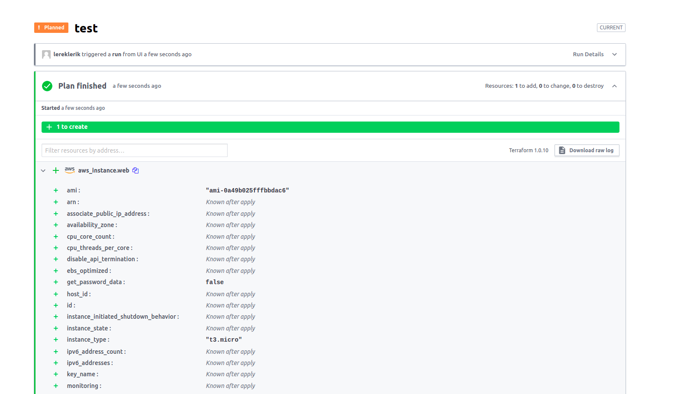
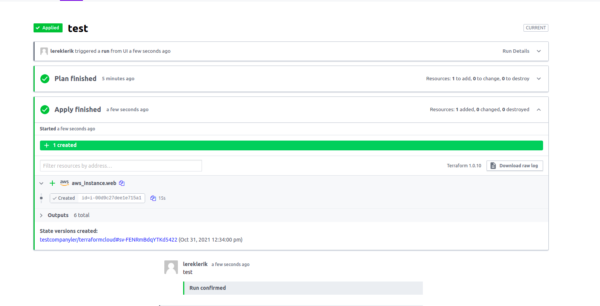
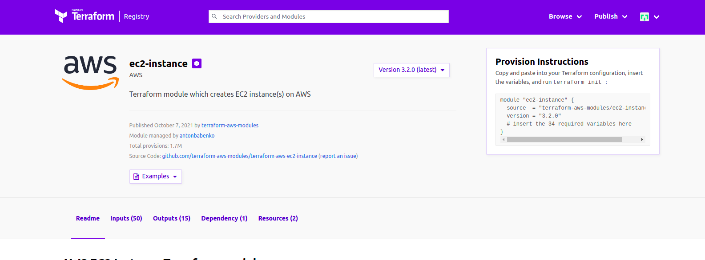
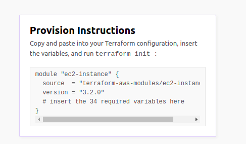
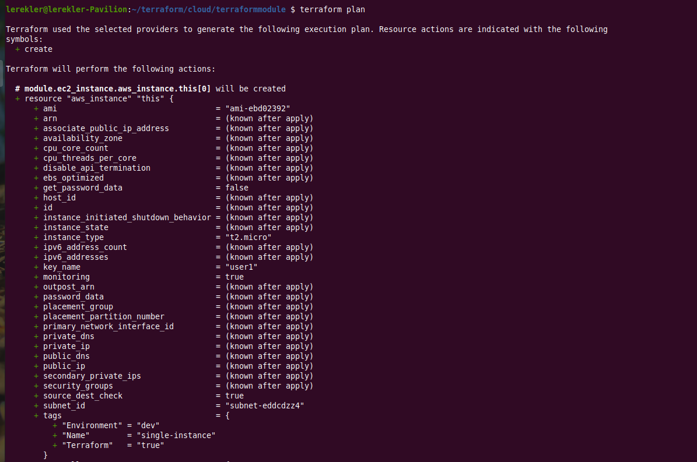

# Домашнее задание к занятию "7.4. Средства командной работы над инфраструктурой."

## Задача 1. Настроить terraform cloud (необязательно, но крайне желательно).

* Git-репозиторий [terraformcloud](https://github.com/lereklerik/terraformcloud.git)

* `terraform plan and aplly`:
 


-------------------------------------------------------


-------------------------------------------------------

## Задача 2. Написать серверный конфиг для атлантиса.

-------------------------------------------------------
Создай `server.yaml` который скажет `атлантису`:

* Укажите, что `атлантис` должен работать только для репозиториев в вашем github (или любом другом) аккаунте.
* На стороне клиентского конфига разрешите изменять `workflow`, то есть для каждого репозитория можно будет указать свои дополнительные команды.
* В workflow используемом по-умолчанию сделайте так, что бы во время планирования не происходил `lock` состояния.
-------------------------------------------------------

[server.yaml](server.yaml)

-------------------------------------------------------
Создай `atlantis.yaml` который, если поместить в корень terraform проекта, скажет атлантису:

* Надо запускать планирование и аплай для двух воркспейсов `stage` и `prod`.
* Необходимо включить автопланирование при изменении любых файлов `*.tf`.

-------------------------------------------------------
[atlantis.yaml](atlantis.yaml)

-------------------------------------------------------

## Задача 3. Знакомство с каталогом модулей.

В каталоге модулей найдите официальный модуль от aws для создания `ec2` инстансов.

-------------------------------------------------------


[terraform-aws-ec2-instance ](https://github.com/terraform-aws-modules/terraform-aws-ec2-instance)

-------------------------------------------------------

Изучите как устроен модуль. Задумайтесь, будете ли в своем проекте использовать этот модуль или непосредственно ресурс `aws_instance` без помощи модуля?

-------------------------------------------------------
* Вопрос достаточно абстрактный. Ведь каждый проект разный. Всё зависит от условий, которые необходимо учесть при создании инстанса.
* Чтобы понять, достаточно ли будет модуля или наоборот, его придется дорабатывать, можно попробовать развернуть хотя бы с ним свой проект и оценить его удобство.
* Первое, что увидела, это необходимость добавления 34 переменных:



* Получается, уже на этом этапе можно посмотреть, что именно требуется добавить, и нужно ли это в проекте.
* В начале занятий по `terraform` мне этого модуля не хватало, т.к. очень много времени ушло на понимание, как в amazon всё устроено с инстансами =)

-------------------------------------------------------
В рамках предпоследнего задания был создан `ec2` при помощи ресурса `aws_instance`. Создайте аналогичный инстанс при помощи найденного модуля.

-------------------------------------------------------
* [terraform.tfstate](terraform.tfstate)



```shell
$ terraform plan

Terraform used the selected providers to generate the following execution plan. Resource actions are indicated with the following
symbols:
  + create

Terraform will perform the following actions:

  # module.ec2_instance.aws_instance.this[0] will be created
  + resource "aws_instance" "this" {
      + ami                                  = "ami-ebd02392"
      + arn                                  = (known after apply)
      + associate_public_ip_address          = (known after apply)
      + availability_zone                    = (known after apply)
      + cpu_core_count                       = (known after apply)
      + cpu_threads_per_core                 = (known after apply)
      + disable_api_termination              = (known after apply)
      + ebs_optimized                        = (known after apply)
      + get_password_data                    = false
      + host_id                              = (known after apply)
      + id                                   = (known after apply)
      + instance_initiated_shutdown_behavior = (known after apply)
      + instance_state                       = (known after apply)
      + instance_type                        = "t2.micro"
      + ipv6_address_count                   = (known after apply)
      + ipv6_addresses                       = (known after apply)
      + key_name                             = "user1"
      + monitoring                           = true
      + outpost_arn                          = (known after apply)
      + password_data                        = (known after apply)
      + placement_group                      = (known after apply)
      + placement_partition_number           = (known after apply)
      + primary_network_interface_id         = (known after apply)
      + private_dns                          = (known after apply)
      + private_ip                           = (known after apply)
      + public_dns                           = (known after apply)
      + public_ip                            = (known after apply)
      + secondary_private_ips                = (known after apply)
      + security_groups                      = (known after apply)
      + source_dest_check                    = true
      + subnet_id                            = "subnet-eddcdzz4"
      + tags                                 = {
          + "Environment" = "dev"
          + "Name"        = "single-instance"
          + "Terraform"   = "true"
        }
      + tags_all                             = {
          + "Environment" = "dev"
          + "Name"        = "single-instance"
          + "Terraform"   = "true"
        }
      + tenancy                              = (known after apply)
      + user_data                            = (known after apply)
      + user_data_base64                     = (known after apply)
      + volume_tags                          = {
          + "Name" = "single-instance"
        }
      + vpc_security_group_ids               = [
          + "sg-12345678",
        ]

      + capacity_reservation_specification {
          + capacity_reservation_preference = (known after apply)

          + capacity_reservation_target {
              + capacity_reservation_id = (known after apply)
            }
        }

      + credit_specification {}

      + ebs_block_device {
          + delete_on_termination = (known after apply)
          + device_name           = (known after apply)
          + encrypted             = (known after apply)
          + iops                  = (known after apply)
          + kms_key_id            = (known after apply)
          + snapshot_id           = (known after apply)
          + tags                  = (known after apply)
          + throughput            = (known after apply)
          + volume_id             = (known after apply)
          + volume_size           = (known after apply)
          + volume_type           = (known after apply)
        }

      + enclave_options {
          + enabled = (known after apply)
        }

      + ephemeral_block_device {
          + device_name  = (known after apply)
          + no_device    = (known after apply)
          + virtual_name = (known after apply)
        }

      + metadata_options {
          + http_endpoint               = "enabled"
          + http_put_response_hop_limit = 1
          + http_tokens                 = "optional"
        }

      + network_interface {
          + delete_on_termination = (known after apply)
          + device_index          = (known after apply)
          + network_interface_id  = (known after apply)
        }

      + root_block_device {
          + delete_on_termination = (known after apply)
          + device_name           = (known after apply)
          + encrypted             = (known after apply)
          + iops                  = (known after apply)
          + kms_key_id            = (known after apply)
          + tags                  = (known after apply)
          + throughput            = (known after apply)
          + volume_id             = (known after apply)
          + volume_size           = (known after apply)
          + volume_type           = (known after apply)
        }

      + timeouts {}
    }

Plan: 1 to add, 0 to change, 0 to destroy.

Changes to Outputs:
  + account_id  = "***"
  + caller_arn  = "arn:aws:iam::***:root"
  + caller_user = "***"

```
-------------------------------------------------------
